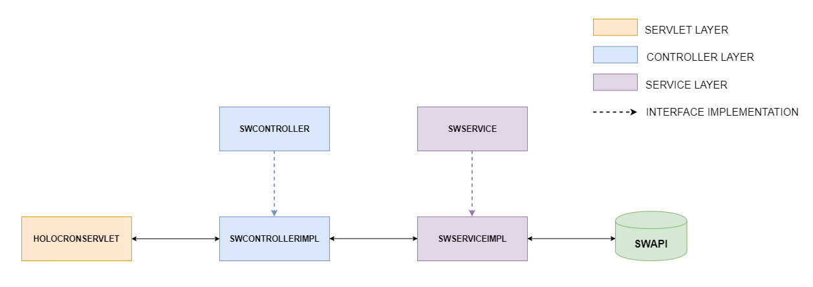
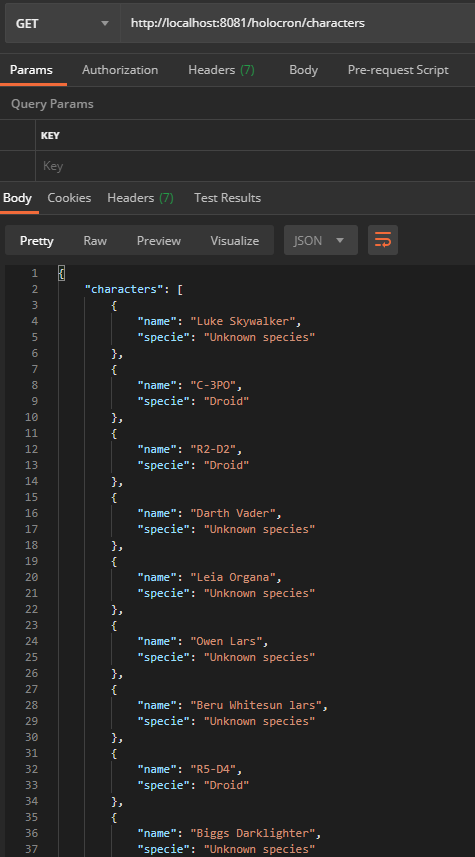
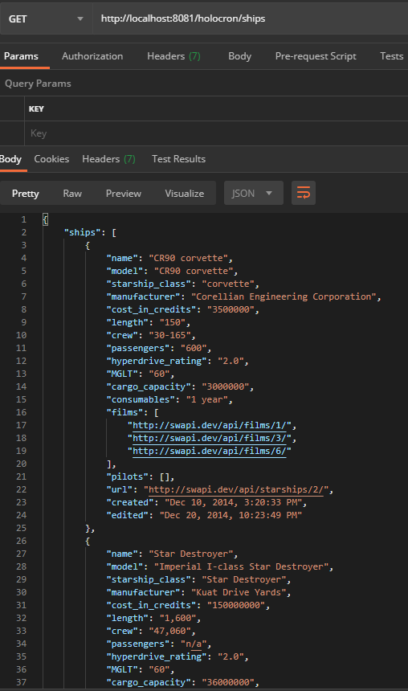
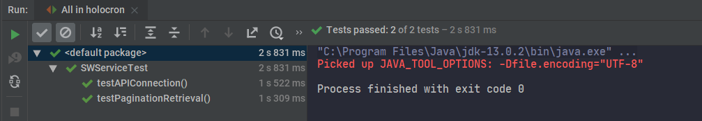

# Holocron

-----

- Author: Alberto Mut
- Version 1.0. 
- Date: 23/07/2020

-----------

## Project diagram

## Considerations

- The application at this point doesn't use any framework. It should be easily ported to Spring, for example.
- The project structure is designed to scale: more model objects and API calls can be added easily and without problems.
- Right now there are some places where there's duplicate code. Specifically in the `SWServiceImpl` class, where two API calls share almost the same code. The reasoning behind this decision is that, even if right now the functionality is almost the same, it's better to separate it into two service methods to allocate future changes than cram all the code in the same method and risking it to grow out of control as more endpoint calls are added. 
- This project was created using TDD, so the tests cover all the functionality. The main classes also reuse much of the tests code.
- The tests are not unit tests, they use external sources (namely, the SWAPI endpoints). This decision was made because there isn't any business logic in the project, just some data manipulation to put all the entities in the same list. Therefore, mocking the data would be pointless as we're not doing anything with it. The tests check the availability of the data source and the aforementioned manipulation. The moment business logic is added to the requirements, unit tests will be added.
- The JSON listing the characters and the ships can easily be upgraded with more information (date, version, etc).
- Due to the pagination of the SWAPI response we've had to make several calls to retrieve all the characters and the ships, and that makes the service unbearably slow. This can be solved by adding a cache layer or even a MongoDB database with a scheduled job to check the data source and look for changes in the response.
- The project repository uses Gitflow.

## How to run this software

First of all, Apache Tomcat must be installed in the machine that will run the service. There are several approaches depending on the OS and they can be found here: https://tomcat.apache.org/tomcat-9.0-doc/setup.html

A Java IDE may also be installed in order to open the project and execute the tests more easily. It could be done via command line, but it's more comfortable to use an IDE.

We'll need Apache Maven as well to generate the .war artifact to be deployed and run in the server.

### Running the service inside an IDE

- Start the IDE (to develop Holocron we've used Intellij IDEA, but any standard Java IDE could be used).
- Run `maven install` and make sure that `holocron.war` has been generated in the `target` directory.
- Create a tomcat server (depending on the IDE) with this features:
  - Name: Holocron
  - HTTP Port: 8081
  - Application server: select the folder where you've installed Tomcat
  - Deployment/artifacts: `holocron.war`
- Run the server. That should deploy the `war` correctly.
- At this point all the tests should've been passed or otherwise the `maven install` command would've failed.

### Running the service remotely

- We must first get a remote server with Java and Tomcat installed. 
- Generate `holocron.war` either via command line or with an IDE. If a command line is used this will come in handy: https://www.javatpoint.com/war-file
- Upload the `holocron.war` to the server via FTP, SSH or Tomcat webap via the `[tomcat url]:[tomcat port]/manager.html` url. 
- Run the `.war`.

### Accessing the service

- The service can be accessed locally using the url `http://localhost:8081/holocron/` followed by either `/ships` or `/characters` depending on the result we'd like to retrieve.
- The service can be accessed remotely by changing the url and the port for the ones where the artifact has been deployed. However, the endpoints will remain the same.

## Screenshots

When tested via Postman, the result should look like this:

- And when the tests are run in an IDE the result should be this:

