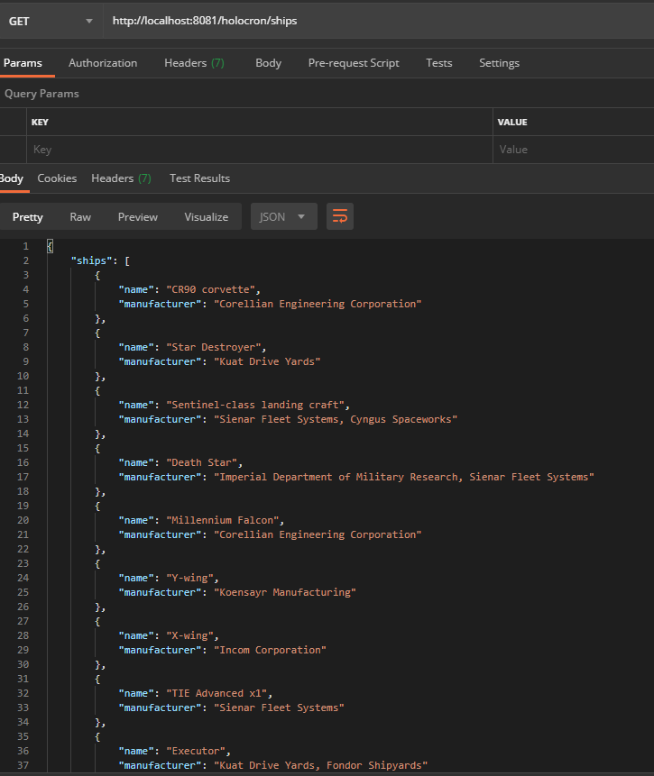

# Holocron

-----

- Author: Alberto Mut
- Version 1.0. 
- Date: 23/07/2020

-----------

## Project diagram

The above diagram is a screenshot of the `Holocron.drawio` file attached to this project.

## Considerations

- The application doesn't use any framework. It should be easy to rewrite using Spring, for example.
- The project structure is designed to scale: more model objects and API calls can be added easily.
- Right now there are some places where there's duplicate code. Specifically in the `SWServiceImpl` class, where two API calls share the pagination retrieval code. The reasoning behind this decision is that, even if right now the pagination functionality is almost the same, it's better to separate each entity into its own service call than cram all the code in the same method and risk it to grow out of control as more endpoint calls are added.
- This project was created using TDD, so the tests cover all the functionality. That's why the main classes reuse much of the test code.
- The tests are not unit tests, they use external sources (namely, the SWAPI endpoints). This decision was made because there isn't any business logic in the project, just some data manipulation to filter the responses and return just the desired information. Therefore, mocking the data would be pointless as we're not doing anything with it. The tests check the availability of the data source and the aforementioned manipulation. The moment business logic is added to the requirements, proper unit tests can be added.
- The JSON objects returning the characters and the ships can easily be upgraded with more information.
- There are two main classes for each entity, a Holocron model class with the `Hol` prefix and a SWAPI model class with the `SW` prefix. This is so we can map the entire source entity to an object model and choose which information we wish to return to the client (in this case, name and manufacturer for ships, and name and species for characters).
- Due to the pagination of the SWAPI responses and the successive calls to retrieve all the characters' species the service is unbearably slow, taking between 15 to 20 seconds to retrieve the characters list. This can be solved by adding a MongoDB database and a scheduled job to check the data source and look for changes in the data.
- In the service method `peopleToCharacters()` we use the first element of the `species` list instead of iterating through it and make a call for each species because every character belongs to only one species, thus we asume the list will always have one element. Why the species is a list instead of a string is unknown.

## Project information

- The project repository uses Gitflow and it's stored in Github.
- The IDE we used to write the code is IntelliJ IDEA Ultimate edition.
- The libraries used in the project are Lombok, Gson, JUnit, log4j and Hamcrest.
- The service has been tested using Postman.

## How to run this software

First of all, Apache Tomcat must be installed in the machine that will run the service. There are several approaches depending on the OS and they can be found here: https://tomcat.apache.org/tomcat-9.0-doc/setup.html

A Java IDE may also be installed in order to open the project and execute the tests more easily. It's not mandatory and could be done via command line, but it's more comfortable to use an IDE.

We'll need Apache Maven as well to generate the `.war` artifact to be deployed and run in the server.

### Running the service inside an IDE

- Start the IDE (to develop Holocron we've used Intellij IDEA, but any standard Java IDE could be used).
- Run `maven install` and make sure that `holocron.war` has been generated in the `target` directory.
- Create a tomcat server (depending on the IDE) with this features:
  - Name: Holocron
  - HTTP Port: 8081
  - Application server: select the folder where you've installed Tomcat
  - Deployment/artifacts: `holocron.war`
- Run the server. That should deploy the `war` correctly.
- At this point all the tests should've been passed or otherwise the `maven install` command would've failed.

### Running the service remotely

- We must first get a remote server with Java and Tomcat installed. 
- Generate `holocron.war` either via command line or with an IDE. If a command line is used this will come in handy: https://www.javatpoint.com/war-file
- Upload the `holocron.war` to the server via FTP, SSH or Tomcat webap via the `[tomcat url]:[tomcat port]/manager/html` url. 
- Run the `.war`.

### Accessing the service

- The service can be accessed locally using the url `http://localhost:8081/holocron/` followed by either `ships` or `characters` depending on the result we'd like to retrieve.
- The service can be accessed remotely by changing the url and the port for the ones where the artifact has been deployed. However, the endpoints will remain the same.

## Screenshots

When tested via Postman, the result should look like this:

- And when the tests are run in an IDE the result should look this:

